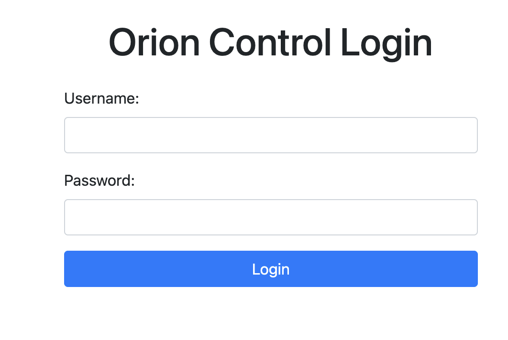
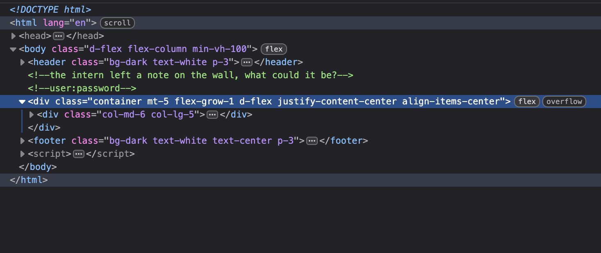

# CSAW CTF Quals 2025: web/orion-override

## Context & Vulnerability

We are provided a website that has a login page. We are not provided with challenge source code.

## Exploitation

When we are presented with a login page, our first instinct is to bypass the login process with something like SQLi. In this case, logging in was actually much easier. If we inspect the site with our browser, we can see a comment in the HTML with a username and password (redacted in the challenge solutions):





Upon logging in, we see a dashboard where we must click the "Abort" button to abort the mission. However, only admin is able to abort the mission.

We notice our URL, which ends in admin=false.

`http://localhost:3000/dashboard?admin=false`

Our first instinct is to switch false to true, but this still doesn't let us abort the mission.

We may try an HTTP parameter pollution attack, where we overload the parameters of the end of a URL in hopes that the backend doesn't properly check all fields. We try a URL as such:

`http://localhost:3000/dashboard?admin=true&admin=true`

Now, we see we are able to abort the mission!

## Vulnerability

A HTTP parameter pollution (HPP) vulnerability is caused by a misconfiguration in how parameters are parsed. The CTF organizers provided a snippet of how they parsed parameters in the solution:

```JavaScript
if (Array.isArray(adminParam)) {
    // multiple admin params → check only last, no session check
    if (adminParam.at(-1) === "true") {
        return res.sendFile(__dirname + '/views/admin.html');
    }
}
```

As we can see, the code only checks for the last parameter, and also doesn't do a session check to see if we are admin. These two vulnerabilities combined allow us to do HPP.

## Remediation

The solution here is simple: better configure your parameter checks to ensure the correct parameter is admin! Additionally, providing a session check that we are admin would help strengthen our app.

# Sources/Credits

Written by Madalina Stoicov

- https://github.com/osirislab/CSAW-CTF-2025-Quals-Public/tree/main
