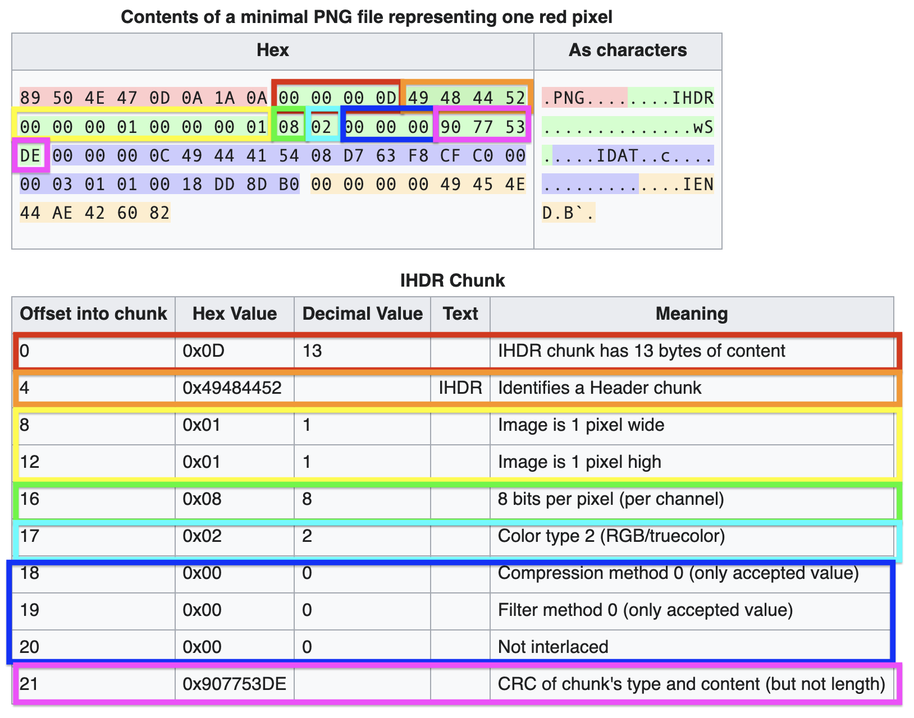
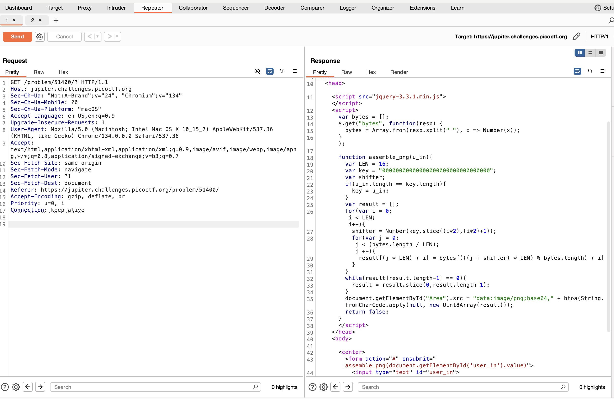
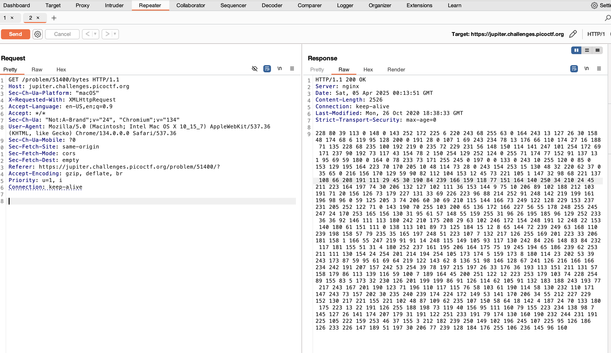

# PicoCTF: Java Script Kiddie 2

## Context

This is an extension of PicoCTF's Java Script Kiddie. 

We are provided with a website that prompts you to enter some text. We are not given information on what the text should be. Upon submitting that text, we get a broken image link. We are not provided with any site source code.

## Background Information: PNG images

Every PNG image contains the same first 8 bytes, known as the "PNG signature": 89 50 4E 47 0D 0A 1A 0A. 

The next chunk of a PNG is the image header (IHDR), which contains information about the image's width, depth, and color information. The image below displays what the IHDR could look like for a basic image. Note that the first 8 bytes of the IHDR are the size of the IHDR chunk and the fact that the chunk is an IHDR. Therefore, these bytes will be consistent throughout all PNGs: 00 00 00 0D 49 48 44 52.



## Vulnerability

As we are given no source code for this challenge, we may try to get more information by capturing requests via BurpSuite.

We see that upon sending text in the website's input area, two requests are sent. We capture both of them and send each to the BurpSuite Repeater for further analyzing.

Upon hitting "Send" in the BurpSuite Repeater for the first request, we see that the HTML contains a JavaScript script. See `jsk2.js` for the script. It gathers information from /bytes (see next paragraph), calls a function assemble_png, and then pieces together an image.



Upon hitting "Send" in the BurpSuite Repeater for the second request, we see that we are directed to /bytes and we get a series of bytes in our response. See the top of `jsk2_solver.c` (char* bytes_as_string) for a possible version of the bytes (every instance of the challenge will have a slightly different set of bytes).



Putting these pieces of information together we gather that the assemble_png function does the following:
1. Set a default key of 00000000000000000000000000000000 (32 0s)
2. If the inputted key from the user is 16 digits long, keep the default key. Else, make the key the user's inputted key.
3. For every digit in the key, grab 1/16 of the bytes and calculate a new positition for each byte in that chunk depending on the value of the digit in the key.
4. Eventually, this shuffling will rearrange all of the bytes into a result array.

We realize that we must input the key that will rearrange the bytes to resemble a PNG.

## Exploitation

Let's write a script that will find the key we need to use. Please reference jsk2_solver.c. 

First we must acknowledge that the bytes sent by the site do not at all resemble a PNG. Recall that the first 8 bytes must be 89 50 4E 47 0D 0A 1A 0A (in decimal: 137 80 78 71 13 10 26 10). The next 8 bytes of any PNG will be 00 00 00 0D 49 48 44 52 (in decimal: 0 0 0 13 73 72 68 82). These are the only parts of the target PNG we know. Note that assemble_png relied on 16-byte chunks, signalling that we only need to know the first 16 bytes of the PNG to be able to make a 16-long key to reassemble our PNG. 

Therefore we can declare that the first 16 bytes of our target PNG are:

`int png_bytes[16] = {137, 80, 78, 71, 13, 10, 26, 10, 0, 0, 0, 13, 73, 72, 68, 82};`

I first parsed the bytes to see what length our resulting array would need to be:

```c
  int i;
  int count = 0;

  // copy of initial string for counting number of bytes
  char *bytes_as_string_counting = strdup(bytes_as_string);

  char *token = strtok(bytes_as_string_counting, " ");

  // count the number of bytes
  for (i = 0; token != NULL; i++)
  {
    count++;
    token = strtok(NULL, " ");
  }

  // official bytes int array with count number of slots
  int bytes[count];
```
I then made an int array for our bytes:

```c
  // make copy for adding numbers to bytes array
  char *bytes_as_string_copy = strdup(bytes_as_string);

  // reassign token
  token = strtok(bytes_as_string_copy, " ");

  // iterate again and add numbers to the bytes array
  for (i = 0; token != NULL; i++)
  {
    bytes[i] = atoi(token);
    token = strtok(NULL, " ");
  }
```
To construct the key, I iterated once for each position in the key, and for each iteration iterated through all possible digits. Note that the JS script had `shifter = Number(key.slice((i*2),(i*2)+1));`, letting us know that only digits 0-9 are possible key digits. We also see that only even-numbered indexes will be selected in the key rearrangement process. Therefore, we will add a character in between every number in `png_bytes`. 

`int png_bytes[32] = {137, 0, 80, 0, 78, 0, 71, 0, 13, 0, 10, 0, 26, 0, 10, 0, 0, 0, 0, 0, 0, 0, 13, 0, 73, 0, 72, 0, 68, 0, 82};`

When we iterate, we will make sure to calculate `i*2` for the indexes. 

Through these iterations, if the target bytes in `png_bytes` matched the calculated byte in, `bytes` we added that shifter to the key and proceeded to the next digit in the key. The calculation for which byte to get in `bytes` is based off `assemble_png`'s calculations:

`result[(j * LEN) + i] = bytes[(((j + shifter) * LEN) % bytes.length) + i]`

In my script, there is no inner "j" loop because we are manually going through the possible shifters, so my calculations are a bit simpler:

`index = ((curr_shifter * 16) % count) + i;`

This is what this whole portion of the script looks like:

```c
  // Now for the solving!

  int key[32];
  int shifters[10] = {0, 1, 2, 3, 4, 5, 6, 7, 8, 9};
  int curr_shifter;
  int index;
  int j;

  // for each space in the key array
  for (i = 0; i < 33; i++)
  {
    // for each possible shifter
    for (j = 0; j < sizeof(shifters); j++)
    {
      curr_shifter = shifters[j];

      /*
      Calculate the index of bytes based off the original script
      Original from JS script: bytes[(((j + shifter) * 16) % bytes.length) + i]
      We do not add anything to shifter because we're just iterating through possible shifters
      */
      index = ((curr_shifter * 16) % count) + i;

      // if the bytes in the PNG array match our calculated bytes,
      // add key shifter to our key array
      if (png_bytes[i*2] == bytes[index])
      {
        key[i*2] = curr_shifter;
        break;
      }
    }
  }
```
From this script we are able to calculate the key needed for the specific set of bytes we were given! Once entering the key into the website, we are given a QR code. I just scanned it to get the flag, but because we are security-minded people, you should not scan random QR codes and instead use a QR code decoder to see where it gets you.

## Remediation

This kind of challenge is not something you would find naturally as an exploit, but it shows how easy it can be to reassemble a PNG if all we need are the first 16 bytes. To make this reassembling more difficult, the key could be longer (so we would need to iterate through possible values of width and length, etc.), the unscrambling algorithm could be more complex, or the key could include both letters and numbers (so we would have to iterate through more possible values for the key).

Through this challenge, we also see how important it might be to use a good scrambling algorithm for encryption purposes.

# Sources/Credits

Written by Madalina Stoicov

- https://en.wikipedia.org/wiki/PNG
