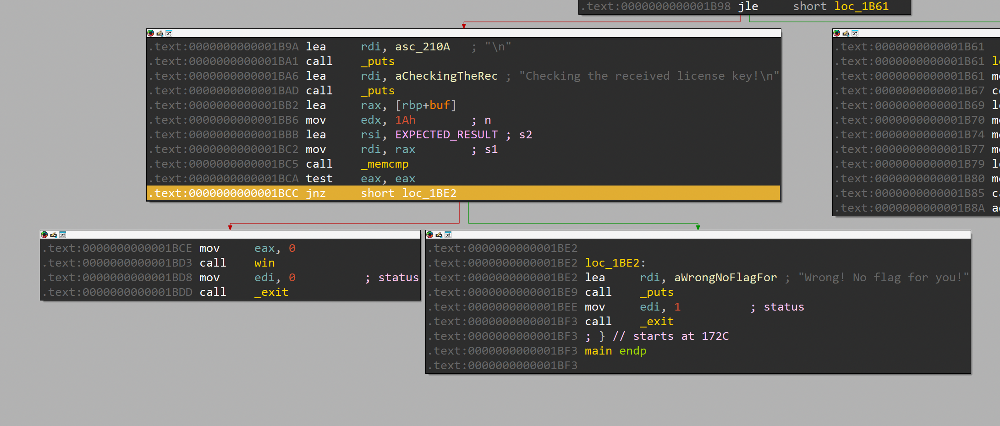

# Pwn College: Dojos: Program Security: Patched Up (Easy)

## Context

We are provided with a binary, `patched-up-easy`. 

## Analysis

Before beginning analysis, I just ran the program and put in some garbage values:

```
hacker@reverse-engineering~patched-up-easy:/challenge$ ./patched-up-easy
###
### Welcome to ./patched-up-easy!
###

This license verifier software will allow you to read the flag. However, before you can do so, you must verify that you
are licensed to read flag files! This program consumes a license key over stdin. Each program may perform entirely
different operations on that input! You must figure out (by reverse engineering this program) what that license key is.
Providing the correct license key will net you the flag!

Unfortunately for you, the license key cannot be reversed. You'll have to crack this program.

Changing byte 1/5.
Offset (hex) to change: 100
New value (hex): 90
The byte has been changed: *0x654ac203c100 = 90.
Changing byte 2/5.
Offset (hex) to change: 100
New value (hex): 90
The byte has been changed: *0x654ac203c100 = 90.
Changing byte 3/5.
Offset (hex) to change: 100
New value (hex): 90
The byte has been changed: *0x654ac203c100 = 90.
Changing byte 4/5.
Offset (hex) to change: 100
New value (hex): 90
The byte has been changed: *0x654ac203c100 = 90.
Changing byte 5/5.
Offset (hex) to change: 100
New value (hex): 90
The byte has been changed: *0x654ac203c100 = 90.
Ready to receive your license key!

12345
Initial input:

        31 32 33 34 35 0a 00 00 00 00 00 00 00 00 00 00 00 00 00 00 00 00 00 00 00 00

This challenge is now mangling your input using the `md5` mangler. This mangler cannot be reversed.

This mangled your input, resulting in:

        9c 87 3b e9 62 78 58 73 ae a4 81 e3 0b 8d 4a 73 00 00 00 00 00 00 00 00 00 00

The mangling is done! The resulting bytes will be used for the final comparison.

Final result of mangling input:

        9c 87 3b e9 62 78 58 73 ae a4 81 e3 0b 8d 4a 73 00 00 00 00 00 00 00 00 00 00

Expected result:

        d9 e3 1e 04 a6 18 43 b7 99 68 a8 ad c4 be f3 be 00 00 00 00 00 00 00 00 00 00

Checking the received license key!

Wrong! No flag for you!
```

We see that we are prompted to patched some bytes and then enter a license key. If the MD5 hash of the license key is the same as the one it's supposed to be, then we pass and can read the flag. 

Popping the binary into IDA, I found the spot in the logic that deals with reading the flag. There is a `jnz` to jump to an "incorrect license key" function, but if the license key is correct, the code just continues as normal and executes the (appropriately named) win function which reads and prints the flag:



We can simply patch the `jnz` and its offset to 2 NOP bytes, and we can do this with the patching provided to us by the challenge. The offset in the program that this `jnz` occurs at is 1BCC and 1BCD, so we can patch both of these to NOPs. I still used a garbage license key value.

```
...

Changing byte 1/5.
Offset (hex) to change: 1BCC
New value (hex): 90
The byte has been changed: *0x62c700d39bcc = 90.
Changing byte 2/5.
Offset (hex) to change: 1BCD
New value (hex): 90
The byte has been changed: *0x62c700d39bcd = 90.

...
```
```
Ready to receive your license key!

12345
Initial input:

        31 32 33 34 35 0a 00 00 00 00 00 00 00 00 00 00 00 00 00 00 00 00 00 00 00 00

This challenge is now mangling your input using the `md5` mangler. This mangler cannot be reversed.

This mangled your input, resulting in:

        9c 87 3b e9 62 78 58 73 ae a4 81 e3 0b 8d 4a 73 00 00 00 00 00 00 00 00 00 00

The mangling is done! The resulting bytes will be used for the final comparison.

Final result of mangling input:

        9c 87 3b e9 62 78 58 73 ae a4 81 e3 0b 8d 4a 73 00 00 00 00 00 00 00 00 00 00

Expected result:

        d9 e3 1e 04 a6 18 43 b7 99 68 a8 ad c4 be f3 be 00 00 00 00 00 00 00 00 00 00

Checking the received license key!

You win! Here is your flag:
pwn.college{ flag redacted :) }
```


# Sources/Credits

Written by Madalina Stoicov


